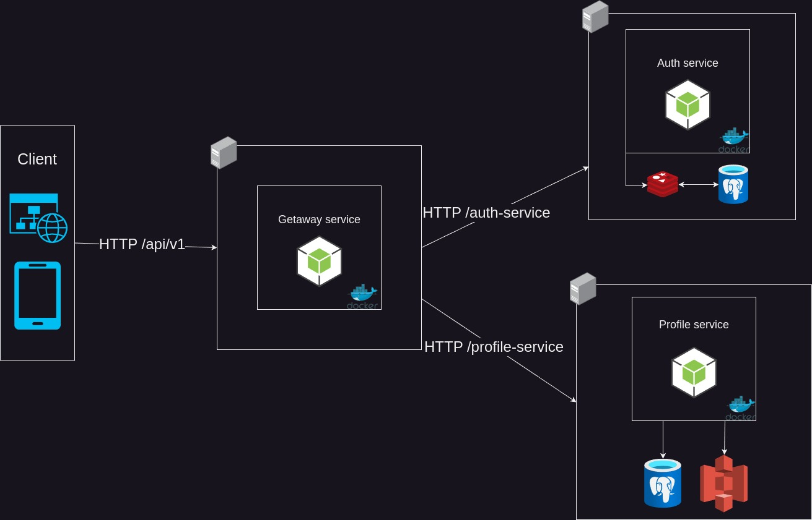

### Microservice back-end application for online courses platform 
## Description 
This is application that could be used by any digital school to store courses, lessons. Track student attendance, generate reports. Make classes with own schedule.

There is view of my current microservice backend application **architecture** 

#### Main features:
- Each microservice is independence and have own database
- Auth use access / refresh json web tokens
- Refresh tokens cached in redis, so updating tokens become really fast
- All photos stored in aws S3 
#### In future: 
- Notification service that would use web sockets
- All notification data would be send to notification service using message queue - **Kafka**
- Role based access control
- Generate report of student attendance into `.csv`
## How to set up?
---
### Prerequisites
Before setting up the project, ensure you have the following installed on your system:
- **Node.js** (via fnm, Fast Node Manager)
- **Bun** (or optionally `npm`, though manual setup will be required)

### Setup project
at this point you need to make .env and start up redis, here is how: 
```bash
chmod +x ./setup.sh
./setup.sh
```
but you still need to check if all .env was configured correctly

### Startup project
so now you would be able to start up project automatically using 
```bash
chmod +x ./startup.sh
./startup.sh
```

**Enjoy**